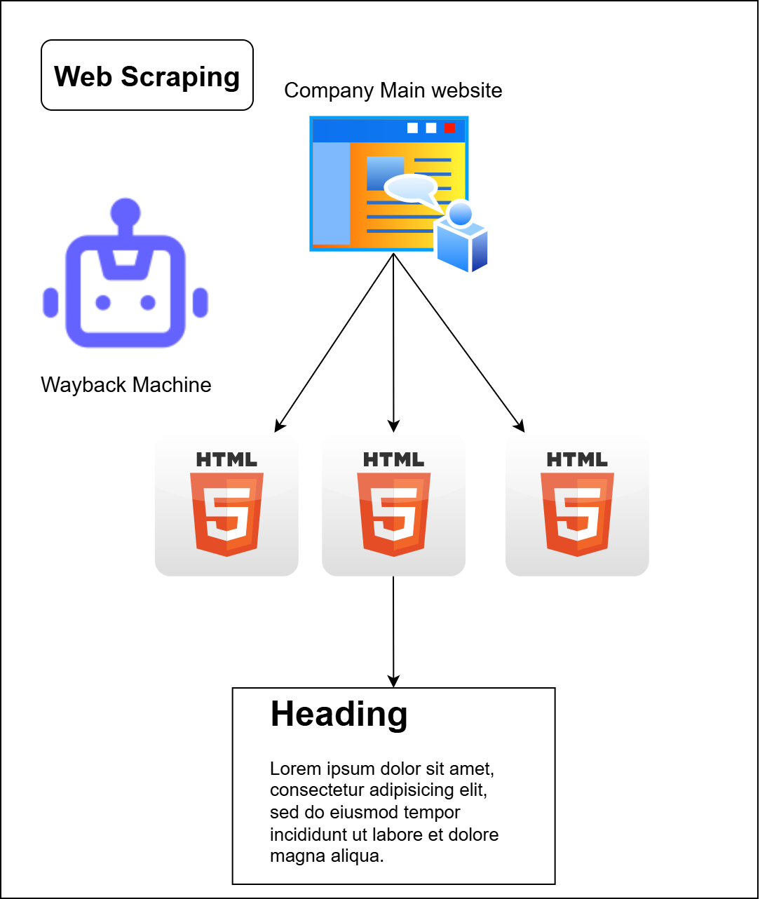

# Dual Attention Opportunity Discovery

---

## Overview

This repository implements a sophisticated approach to market research and technology discovery using machine learning techniques. It leverages the **Dual Attention Model** to extract relevant keywords from company webpages, followed by a **Transformation Matrix** to map relationships between companies and patents. The end goal is to enable users to identify patents or companies associated with specific technologies of interest, facilitating informed decision-making during market research.

### Key Features

- Extracts keywords from company webpages using the Dual Attention Model.
- Computes a Transformation Matrix to establish mappings between companies and patents.
- Provides a pipeline for discovering technology-related patents or companies.
- Includes modular code for preprocessing, modeling, and evaluation.

<!-- 

 -->

<details>
<summary><strong>Toggle to view Web Scraping Process</strong></summary>

</details>

<details>
<summary><strong>Toggle to view Dual Attention Mechanism</strong></summary>

</details>

<details>
<summary><strong>Toggle to view Transformation Matrix Approach</strong></summary>

</details>

---

## Prerequisites

- Python 3.8 or higher
- Git (for cloning the repository)
- Required Python packages (listed in `requirements.txt`)

---

## Installation

### Cloning the Repository

To get started, clone the repository from GitHub using the following command:

```bash
git clone https://github.com/pdz1804/dual-attn-op-discovery.git
```

Navigate to the project directory:

```bash
cd dual-attn-op-discovery
```

### Setting Up the Environment

1. Create a virtual environment (optional but recommended):
   ```bash
   python -m venv venv
   source venv/bin/activate  # On Windows: venv\Scripts\activate
   ```
2. Install the required dependencies:
   ```bash
   pip install -r requirements.txt
   ```

---

## Usage

### Directory Structure

```
dual-attn-op-discovery/
├── config/                                 # Configuration files
│   ├── hyperparams.py                      # Hyperparameter settings
│   └── paths.py                            # Path configurations
├── data/                                   # Datasets and data processing
│   ├── CNJP_US_data/                       # Country-specific data
│   ├── models/                             # Trained Models
│   └── outputs/                            # Output files
├── data_loader/                            # Data loading utilities
│   ├── tokenizer.py                        # Tokenizer implementation
│   └── web_data_preprocess.py              # Web data preprocessing
├── imgs/                                   # Images and visualizations
├── models/                                 # Model-related scripts
│   ├── dual_attention.py                   # Dual Attention model
│   ├── patent2product.py                   # Patent-to-product mapping
│   └── product2patent.py                   # Product-to-patent mapping
├── myenv/                                  # Environment configuration files
├── notebooks/                              # Jupyter notebooks for experimentation
│   ├── rerun-dual-attention-mode.ipynb     # Dual attention experiment
│   └── rerun-transformation_matrix.ipynb   # Transformation matrix experiment
├── pipelines/                              # Pipeline scripts
│   ├── dual_attention_pipeline.py          # Dual attention pipeline
│   └── patent_product_pipeline.py          # Patent-product pipeline
├── training/                               # Training and evaluation scripts
│   ├── train_dual_attention.py             # Dual attention training
│   └── evaluate.py                         # Dual attention evaluating
├── utils/                                  # Utility functions
│   ├── colorize_attention.py               # Attention visualization
│   ├── count_params.py                     # Parameter counting
│   ├── model_utils.py                      # Model utilities
│   ├── plot_utils.py                       # Plotting utilities
│   ├── seed_everything.py                  # Random seed management
│   ├── select_keywords.py                  # Keyword selection
│   └── vector_utils.py                     # Vector utilities
├── .gitignore                              # Git ignore file
├── main.py                                 # Main entry point
├── pdzttb.log                              # Log file
├── README.md                               # Repository documentation
├── requirements.txt                        # Dependency list
```

### Running the Code

The application can be run using the `main.py` script with command-line arguments to select the pipeline and mode. Use the following commands based on your needs:

- **Run the Dual Attention Pipeline**:

  ```bash
  python main.py --pipeline=dual_attn
  ```

  This executes the `dual_attention_pipeline.run()` function to extract keywords from company webpages.
- **Run the Patent-Product Pipeline**:
  The `patent_product` pipeline supports three modes: `train`, `test`, and `chat`. Specify the mode using the `--mode` argument:

  - **Train Mode**:
    ```bash
    python main.py --pipeline=patent_product --mode=train
    ```

    This runs `patent_product_pipeline.train_pipeline()` to train the models.
  - **Test Mode**:
    ```bash
    python main.py --pipeline=patent_product --mode=test
    ```

    This runs `patent_product_pipeline.test_pipeline()` to evaluate the models.
  - **Chat Mode**:
    ```bash
    python main.py --pipeline=patent_product --mode=chat
    ```

    This runs `patent_product_pipeline.test_pipeline_chat()` for interactive querying.

**Note**: Ensure `config/hyperparams.py` and `config/paths.py` are configured before running the scripts. Logs are saved to `pdzttb.log`, and outputs are stored in `data/outputs/` or `models/`.

### Output

- Keyword extractions are saved in `data/outputs/`.
- Transformation Matrix and mappings are generated in `models/` or `data/`.

---

## Contributing

Contributions are welcome! Please fork the repository, create a feature branch, and submit a pull request with detailed changes.

---

## License

This project is licensed under the **MIT License**. See [`LICENSE`](./LICENSE) for details.

---

## Author

Built by [Nguyen Quang Phu (pdz1804)](https://github.com/pdz1804) and [Tieu Tri Bang (DarynBang)](https://github.com/DarynBang). 

---

## Contact

Reach out or open an [issue](https://github.com/pdz1804/dual-attn-op-discovery/issues) for support or ideas.

---

